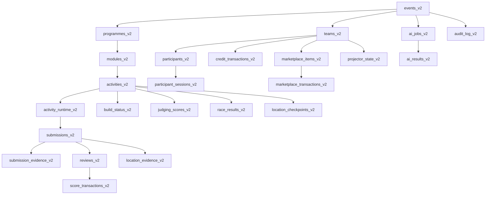

# EXOS Core v2 — Database Foundation

This document captures the schema-first foundation for the new canonical v2 runtime.
No migration has been executed against production in this queue.

## Canonical hierarchy

## Table map

| Domain | Table |
|---|---|
| Programme hierarchy | `events_v2`, `programmes_v2`, `modules_v2`, `activities_v2` |
| Teams and identity | `teams_v2`, `participants_v2`, `participant_sessions_v2` |
| Activity execution | `activity_runtime_v2` |
| Evidence pipeline | `submissions_v2`, `submission_evidence_v2`, `reviews_v2` |
| Ledger layer | `score_transactions_v2`, `credit_transactions_v2` |
| Supporting surfaces | `marketplace_items_v2`, `marketplace_transactions_v2`, `build_status_v2`, `judging_scores_v2`, `race_results_v2`, `projector_state_v2`, `location_checkpoints_v2`, `location_evidence_v2`, `ai_jobs_v2`, `ai_results_v2`, `audit_log_v2` |

## Identity and isolation rules

- All operational entities are scoped by `event_id`.
- `participants_v2` reference `teams_v2` through `team_id`.
- Duplicate same-name registration can only happen with separate explicit identity decisions.
- `exos_v2_join_event_v2` uses per-event/device idempotency key to keep rejoin behaviour deterministic.
- `exos_v2_restore_join` returns `RecoveryRequired` when ambiguity or cross-device mismatch is detected.

### Atomic queue

- `exos_v2_join_event_v2` uses advisory locks (`v_event_lock`, `v_identity_lock`) to keep registration + allocation in one serialised path per event/name.
- Session upsert uses `ON CONFLICT (event_id, idempotency_key)` for safe retries and repeated clicks.
- Duplicate name checks run before allocation; ambiguous matches return `RecoveryRequired`.
- `exos_v2_admin_recover_identity` and `exos_v2_admin_merge_participants` support controlled, audited recovery operations.

## Scoring modes

- `TEAM_COMPETITIVE`: contributes to leaderboard and `score_transactions_v2`.
- `ENTERPRISE`: allowed operationally and stored, but excluded from competitive score paths.
- `NON_SCORING`: recorded but not used in leaderboard/competition derivations.

## Security / integrity

- Foreign keys for all event/ownership relationships.
- Unique and partial-unique constraints for idempotency (`submission_id`, `team_id`, `idempotency_key`).
- Row-level security enabled on all v2 tables.
- Access is privilege-gated:
  - joins and restore are callable by anon/authenticated
  - write/ledger ops are restricted to `service_role`.

## v2 migration artifacts

- Migration: `supabase/020_exos_core_v2_schema.sql`
- Rollback: `supabase/020_exos_core_v2_schema_rollback.sql`
- Verification:
  - `supabase/verification/exos_core_v2_preflight.sql`
  - `supabase/verification/exos_core_v2_postflight.sql`
  - `supabase/verification/exos_core_v2_rollback_verify.sql`
